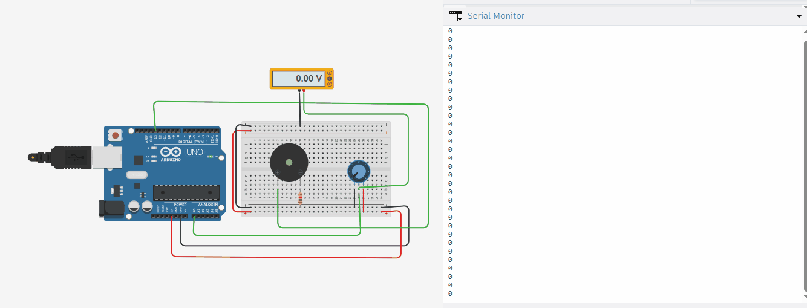

# Arduino ADC Tone Generator

An Analog-to-Digital Converter (ADC) project using Arduino Uno where a potentiometer controls the pitch of a buzzer in real-time. The analog value is read, mapped to a frequency, and displayed on Serial Monitor.

### **Demo**

> **Note**: GIF has no audio. As the potentiometer rotates, the buzzer frequency changes from 250Hz to 5kHz based on ADC value 0-1023.

### **How It Works**
The Arduino Uno reads analog voltage from a 10kΩ potentiometer connected to pin A0. 

1. `analogRead(A0)` converts the 0-5V analog input into a 10-bit digital value from 0-1023
2. The value is scaled to an audible frequency range using `map(0, 1023, 250, 4000)`
3. `tone()` generates a square wave on pin D13 to drive the piezo buzzer
4. Rotating the potentiometer instantly changes the buzzer pitch
5. Raw ADC values are printed to Serial Monitor for debugging

This demonstrates the core ADC principle: converting real-world analog signals into digital data for processing.

### **Components Required**
| Component | Quantity |
| --- | --- |
| Arduino Uno R3 | 1 |
| 10kΩ Potentiometer | 1 |
| Piezo Buzzer | 1 |
| 100Ω Resistor | 1 |
| Multimeter | 1 |
| Breadboard + Jumper Wires | - |

### **Circuit Connections**
| Component | Arduino Pin |
| --- | --- |
| Potentiometer left pin | 5V |
| Potentiometer right pin | GND |
| Potentiometer wiper | A0 |
| Buzzer + | D13 via 100Ω |
| Buzzer - | GND |
| Multimeter probes | A0 and GND |

### **Code**
File: `ADC_Buzzer.ino`

